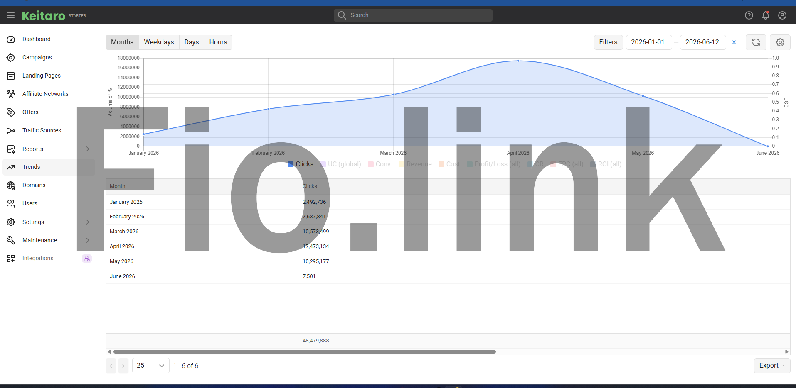

# FSS [F10 Simple Stack]

Lightweight LEMP stack installer & site manager for Ubuntu 24.04.



## Stack

| Component | Version |
|-----------|---------|
| Nginx | 1.28.x (pinned, HTTP/3 ready) |
| PHP-FPM | 8.4 |
| MariaDB | 11.4 |
| Redis | latest |

Extras: Fail2Ban, iptables, Certbot, phpMyAdmin, Filebrowser, WP-CLI, Nginx Bad Bot Blocker, BBR, FSS Cache Manager plugin.

## Install

```bash
fss-install
```

Installs everything: Nginx, PHP, MariaDB, Redis, phpMyAdmin, Filebrowser, Fail2Ban, iptables, sysctl tuning, swap, BBR. Deploys FSS binaries to `/usr/local/fss/` and configs to `/opt/fss/`.

## Uninstall

```bash
fss-uninstall
```

Interactive menu — choose individual components or `A` for full removal.

## Add Site

### WordPress / PHP App

```bash
fss-site add app example.com -php 8.4 -app wordpress -ssl le
fss-site add app example.com -php 8.4 -app wordpress -ssl le -http3
fss-site add app example.com -php 8.4 -app general -ssl self
fss-site add app example.com -php 8.4 -app wordpress --mode single
```

| Flag | Value | Description |
|------|-------|-------------|
| `-d` | domain.com | Domain name (optional, positional after type) |
| `-php` | 8.4 / 8.3 / 8.2 / 8.1 | PHP version |
| `-app` | wordpress / general | App type |
| `-ssl` | le / self / none | SSL mode |
| `-http3` | (no value) | Enable HTTP/3 + QUIC |
| `--mode` | multi / single | User isolation mode (default: multi) |

### Static Site

```bash
fss-site add static example.com -ssl le
fss-site add static example.com -ssl le --mode single
fss-site add static example.com -ssl le -http3
```

### Reverse Proxy — Load Balancer

```bash
fss-site add proxy example.com -backends '10.0.0.1:8080,10.0.0.2:8080' -ssl le
```

### Reverse Proxy — Routes (subpath)

```bash
fss-site add proxy example.com \
  -routes '/api=10.0.0.1:3000,/app=10.0.0.2:8080' \
  -root-mode redirect \
  -root-target /app \
  -ssl le
```

| Flag | Value | Description |
|------|-------|-------------|
| `-backends` | ip:port,ip:port | LB mode backends |
| `-routes` | /path=ip:port,... | Routes mode |
| `-root-mode` | 403 / redirect / proxy | What happens at `/` |
| `-root-target` | /path | Redirect target (if redirect) |
| `-root-backend` | ip:port | Proxy target (if proxy) |

## Mode

| Mode | Behavior |
|------|----------|
| `--mode multi` (default) | Username auto-generated from domain. 1 user = 1 site. |
| `--mode single` | Interactive user selection. 1 user can host multiple sites. Shared FPM pool per-user. |

## Remove Site

```bash
fss-site rm app example.com
fss-site rm static example.com
fss-site rm proxy example.com
fss-site rm example.com          # auto-detect type
```

Auto-detects site type and whether user has other domains. If user has other sites, only removes the specified domain. Otherwise full cleanup: user, FPM pool, DB, SSL, Filebrowser, Redis keys.

## FSS Paths

| Purpose | Path |
|---------|------|
| Binaries | `/usr/local/fss/` |
| Configs & templates | `/opt/fss/conf/` |
| Secrets & tokens | `/opt/fss/data/` |
| Logs | `/var/log/fss/` |

## Credentials

| What | Location |
|------|----------|
| MariaDB root password | `/opt/fss/data/.mysql_root_password` |
| Filebrowser admin | `/opt/fss/data/.filebrowser_admin` |
| Site credentials | `/home/USER/.summary-DOMAIN.md` |

## FSS Cache Manager (WP Plugin)

Auto-installed on WordPress sites. Manages Nginx FastCGI cache from WP admin.

Features: purge per-page, purge all, sitemap preloader, auto-purge on post update, HTTP cache headers, OTA updates.

## Filebrowser

Forked from [iodesk/filebrowser](https://github.com/iodesk/filebrowser) with added features:

- Chown   change file/directory owner via UI
- Compress   compress files and folders on server without downloading first
- Bulk permission   change permissions for multiple files or folders at once

## Directory Structure

```
/home/<user>/
├── domain.com/
│   └── public_html/        # Document root
├── logs/
│   └── domain.com/
│       ├── nginx/          # Access & error logs
│       └── php/            # PHP-FPM error log
├── tmp/php_sessions/       # PHP sessions (isolated)
└── .summary-domain.com.md  # Site credentials
```

## Repository Structure

```
fss-site              # Site management dispatcher
fss-install           # Server installer
fss-uninstall         # Server uninstaller
lib/
  env.sh              # Shared constants & functions
  validate.sh         # Validation helpers
  add/
    app.sh            # Add PHP app
    static.sh         # Add static site
    proxy.sh          # Add proxy site
  rm/
    app.sh            # Remove PHP app
    static.sh         # Remove static site
    proxy.sh          # Remove proxy site
conf/                 # Config templates (nginx, php, mariadb, redis, fail2ban, sysctl)
tools/                # Utility scripts (backup, ssl, iptables, etc.)
fsscache/             # WordPress cache manager plugin source
```
